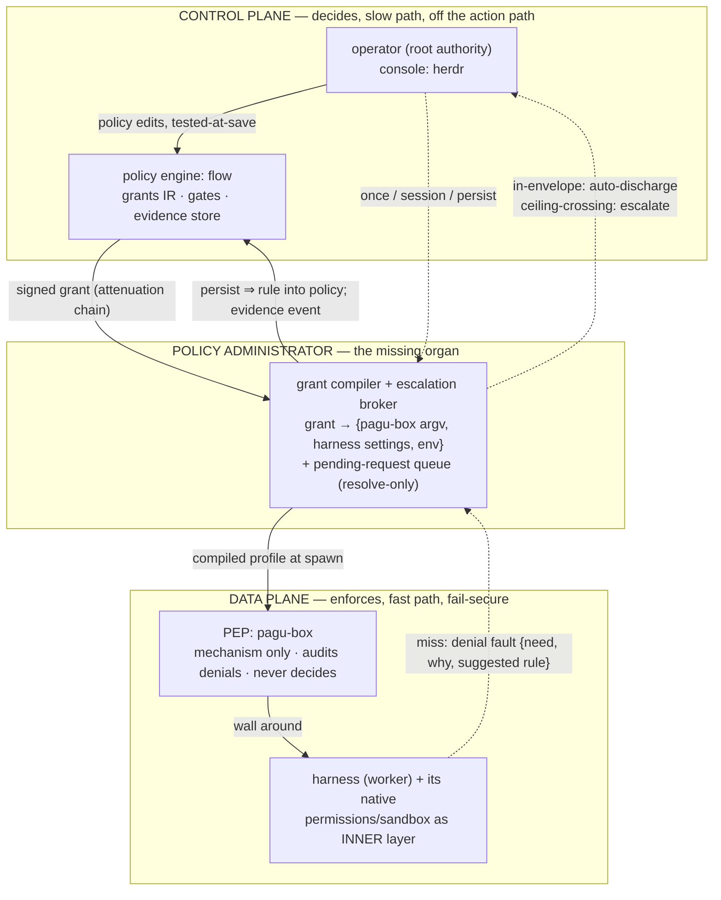

# Composition & the plane split — analysis

**Map:** [What each tool is](#what-each-tool-is) · [Concern matrix](#concern--tool-matrix)
· [Conflicting overlaps](#conflicting-overlaps) · [Prior-art principles](#what-the-prior-art-prescribes)
· [The reconciliation](#the-reconciliation) · [Open tensions](#open-tensions-for-the-design-phase)
· [Sources](#sources)

Companion: [escalation-alignment-analysis.md](./escalation-alignment-analysis.md)
(evidence for the friction, gap matrix R1–R8, directions D1–D4). This doc answers
the structural question: *why did three attempts each solve part of the problem,
and what split composes them?*

## What each tool is

One-line honest roles, from firsthand reading:

| Tool | Role today | Solved | Missing |
| --- | --- | --- | --- |
| **pagu** | vertically-integrated safe harness (no-exec model, cage discovery, envelope auto-approve, human gate, event-sourced log) | the *whole loop* — in miniature | coupled to its own harness; loses to frontier harnesses on raw capability (revealed preference: daily work runs Claude Code/Codex, not pagu) |
| **pagu-box** | horizontal process wall around *any* harness (bwrap/seatbelt compiler) | enforcement for software you don't control | no policy surface, no audit, no escalation — mechanism without authority |
| **flow** | deterministic control plane for agent teams (grants as IR, evidence, gates, harness adapters, lease coordination) | policy authority + evidence — "the execution sandbox must enforce it independently" | deliberately holds **authority without mechanism**; non-goal: "replacing agent-dispatch security enforcement" |
| **herdr** | interactive multiplexer / operator console (panes, agent status, blocked detection) | the operator's *attention surface* | no policy, no enforcement; its control socket is itself a privilege-escalation hazard (`agent-dispatch.sh:175`) |
| **agent-dispatch** | 182-line bash: monotone-narrowing spawn path into pagu-box strict | delegation transitivity (Lampson's rule, enforced) | policy is hardcoded; one profile fits all children |
| **harness-native** (Claude Code / Codex) | per-tool permissions + own sandbox + shipped escalation prompts | the in-session ask-UX | authority is self-administered — the distrusted party hosts its own policy store |

Summary of the triple attempt: **pagu = full stack, weak engine · pagu-box =
mechanism without authority · flow = authority without mechanism.** None is
wrong; they are three planes of one system that were each built as if they had
to stand alone.

## Concern × tool matrix

Where each concern lives today (✓ = substantive implementation, ~ = partial,
✗ = absent). Four-plus cells per row is the disease:

| Concern | pagu | pagu-box | flow | herdr | agent-dispatch | harness-native |
| --- | --- | --- | --- | --- | --- | --- |
| policy language | ✓ envelopes/roles/profiles | ~ profiles+flags | ✓ grants IR (ADR 0005) | ✗ | ~ hardcoded | ✓ settings/rules |
| enforcement | ✓ Deno perms + bwrap tier | ✓ bwrap/seatbelt | ✗ (delegates) | ✗ | ✓ (via pagu-box) | ✓ own bwrap+proxy |
| approval / escalation | ✓ gate + pending queue | ✗ | ✓ gates, human-owned decisions | ~ blocked-status | ✗ (refuse only) | ✓ prompts/classifier |
| audit / evidence | ✓ event-sourced log | ✗ | ✓ canonical event store | ~ server log | ✗ | ~ transcripts |
| delegation attenuation | ✓ gate-never-widen (typed) | ~ (per-launch) | ✓ narrows-by-law | ✗ | ✓ depth + monotone descent | ~ subagent perms |
| secret concealment | ✓ hide/reveal globs | ✓ deny-list | ~ disclosure grants | ✗ | inherits | ✓ credentials deny/mask |
| orchestration / lifecycle | ~ combinators (North Star) | ✗ | ✓ workflow graph | ✓ panes/status | ~ spawn only | ~ subagents |

## Conflicting overlaps

The matrix's redundancy becomes *conflict* at seven concrete points:

**C1 — Five policy languages, zero single source of truth.** "The agent must
not reach `~/.ssh`" is independently stated in pagu-box's deny-list
(`src/linux.nix:169`), pagu's default-secret globs, Claude Code's
`sandbox.credentials`, flow's disclosure policy, and the homelab README table.
Every copy can drift; per the SSoT ladder this is the convention rung — hope.

**C2 — pagu competes with pagu-box+harness for the same slot.** Two
architectures for "safe day-to-day agent": vertical (pagu: own harness, so
security is structural) vs horizontal (pagu-box: wrap frontier harnesses).
Revealed preference chose horizontal for capability reasons; pagu's *security
patterns* (cage discovery, envelope, resolve-only approver, gate-never-widen)
are the valuable residue, currently stranded inside the losing vertical.
pagu's own North Star (workflow-SDK: lawful algebra + envelope) additionally
overlaps flow's kernel territory — two "lawful orchestration cores" in one
ecosystem is one too many, or needs an explicit relationship.

**C3 — Approval-surface fragmentation, no decision memory.** Operator
decisions can be demanded in four places (harness prompt in a pane, pagu
pending queue, flow human-owned gate, herdr blocked-status) and **no layer
records another's decisions**, so no layer can compile decisions into rules.
This is why prompts never decrease — the OpenFlow miss-path's second half
(install the rule) has nowhere to live.

**C4 — Three canonical evidence stores plus a silent enforcer.** flow's event
store, pagu's log, harness transcripts each claim canonical status for their
plane; the actual enforcement layer (pagu-box) writes nothing at all. Denial
evidence — the input the whole refinement loop needs — is produced by the one
component with no pen.

**C5 — Nested-enforcement conflict (verified 2026-07-19).** Stock pagu-box
permits nested userns (probed: `bwrap` works inside `strict`), so
harness-native sandboxing *can* compose inside it. But the dispatcher variant
adds `--disable-userns` to make the PID-1 depth record unforgeable — which
structurally destroys the inner harness sandbox and its escalation UX for
every dispatched child. Two legitimate invariants (immutable delegation record
vs inner-sandbox availability) currently fight over one kernel knob.

**C6 — Policy customization by sed.** The dispatcher variant is built by
`replaceStrings` over pagu-box's *script text*
(`homelab…/machines/workstation/home.nix:10-19`). When the only way to express
a policy variant is patching the enforcer's source, the policy surface is
missing by construction (doc-1 R2, confirmed in the wild).

**C7 — herdr vs flow both hold "what is the agent doing" state.** herdr's
`agent_status` (idle/working/blocked/done) and flow's lifecycle observations
are unlinked replicas of one fact. Barrelfish's lesson applies: replicated
state without explicit messaging is the bug, not the redundancy itself.

## What the prior-art prescribes

Distilled from the two surveys (sources + full principle lists at bottom);
the subset that decides the split:

| # | Principle | Source | Verdict on today's stack |
| --- | --- | --- | --- |
| P1 | Centralized *management*, never centralized per-action decisions; per-action round-trips to the authority are the abandoned Ethane model | Casado retrospective | harness prompts + pagu per-script gate are reactive admission; both fields abandoned it |
| P2 | Escalations compile into rules: an approved miss installs a persistent local grant | OpenFlow miss-path | nowhere implemented (C3) |
| P3 | Fail-secure: authority unreachable ⇒ compiled grants keep enforcing; only *new* escalations fail; temporary grants expire by local timer | OpenFlow fail modes | pagu-box is accidentally fail-secure (static forever); the escalation design must keep this |
| P4 | PE / PA / PEP are three components: deciding a grant ≠ executing it ≠ enforcing it | NIST SP 800-207 | flow≈PE exists, pagu-box≈PEP exists, **PA is the missing organ** |
| P5 | One declarative versioned policy source, compiled per-target to a minimal local artifact; empty policy = deny-all | Tailscale ACLs/GitOps; seL4 CapDL pipeline | absent (C1, C6) |
| P6 | One grant unifies OS-layer and app-layer capability, delivered via identity | Tailscale grants | today OS policy (pagu-box) and app policy (harness settings) are disjoint languages |
| P7 | Tests live in the policy and gate its deployment; stronger rung: analyzable policy language (Lean-modeled Cedar) | Tailscale ACL tests; Cedar | absent; natural fit with the ecosystem's falsifier discipline |
| P8 | Delegation = derivation: record child grants under the parent; revocation = subtree deletion; attenuation offline-composable, widening impossible | seL4 CDT; macaroons | agent-dispatch has the monotone *rule* but no derivation *record* |
| P9 | Escalation = blocking fault → handler in the delegation ancestry → fresh attenuated, expiring grant → operation resumes; approval is a discharge attached to the request, not a durable widening of standing authority | seL4 pager; macaroon third-party caveat | the design shape for doc-1 D3 |
| P10 | Tiered adjudication: a parent freely re-delegates within what it holds (safe by attenuation); only ceiling-crossings escalate to the operator | seL4 partitioning + cgroup delegation | keeps complete mediation compatible with Saltzer-Schroeder *psychological acceptability* — the 1975 name for prompt fatigue |
| P11 | Confinement is transitive or it is nothing; delegation may only travel over mediated channels | Lampson 1973; Cap. Myths Prop. F | agent-dispatch enforces transitivity; herdr panes are the unmediated hole (sp ADR 0015) |
| P12 | Telemetry closes the loop: denial/usage evidence drives widening *and* narrowing proposals (unused grant = drift) | RFC 9315; NIST tenet 7 | needs C4 fixed first |

## The reconciliation

Name the planes, assign each tool its plane, and the conflicts resolve into
seams:

*Legend: solid = grant/enforcement flow (downward, compile-time); dotted =
escalation miss-path (upward, runtime, the exception by construction).*

Plane assignments and what they dissolve:

- **flow = PE + evidence plane.** Already self-describes as exactly this
  (ARCHITECTURE.md: "deterministic control plane around nondeterministic
  actors"; ADR 0005 grants; ADR 0015 refusal evidence). C4 resolves by making
  flow's store canonical for *decisions and evidence*, while transcripts stay
  canonical for *conversation* — different planes, no competition.
- **pagu-box = PEP.** Stays mechanism-only (seL4's kernel stance: enforce,
  report, never decide). Its doc-1 gaps map cleanly: R1 audit = PEP telemetry,
  R2 policy-as-data = the compiled-artifact interface, R6 fidelity = PEP
  reporting its lowering honestly. It should *not* grow an approval UI —
  that's the PA's job.
- **The PA is the missing organ — and it is small.** Today three degenerate
  PAs exist: hand-typed flags, the homelab sed patch, agent-dispatch's bash.
  The design-phase target is one real one: compiles a grant into *both*
  pagu-box argv *and* harness-native settings (P6 kills C1: both enforcement
  layers generated from one grant — the generate rung), hosts the resolve-only
  pending queue (doc-1 D3), applies P9/P10 adjudication, writes every decision
  back to flow as evidence (P2, P12).
- **herdr = operator console, not a security component.** It renders the PA's
  pending queue and lets the operator resolve it where their attention already
  lives; it launches panes *through* the PA (closing sp ADR 0015's hole, C7's
  status replica becomes a projection of flow/PA state, P11's mediated-channel
  rule keeps its socket outside every sandbox).
- **agent-dispatch = the PA's spawn path, generalized.** Its monotone-descent
  logic survives as the PA's attenuation check; its hardcoded profile becomes
  a grant it receives rather than embeds. The depth record becomes a proper
  derivation record (P8): child grants recorded under the parent, revocation =
  subtree teardown.
- **pagu = two honest futures, explicitly not "the day-to-day worker".**
  (a) Its security patterns are the PA's reference implementation — cage
  permission-discovery, envelope auto-approve, resolve-only remote approver,
  gate-never-widen — port the shapes, not the runtime. (b) The remaining
  vertical niche is the *high-trust bastion*: the no-exec harness for
  irreversible/unattended operations where structural containment beats
  capability (its own wedge: "contain a compromised model"). Its North-Star
  SDK should be declared either flow-adjacent (an actor-side algebra *under*
  flow governance) or paused — two lawful orchestration cores is C2 restated.
- **Harness-native permissions = inner data plane, generated.** Keep the
  harness's shipped ask-UX (it is good, and P1 says the *classifier/envelope*
  handles the routine); but its settings become a compile target of the grant
  (P5/P6), not a hand-maintained second policy. Claude Code's
  `--settings <file>` and Codex's config are the existing injection points.
  The outer wall (pagu-box) guarantees the ceiling, so the inner layer's
  escape hatches (`dangerouslyDisableSandbox`, bypass) land *inside* the wall
  — "full permissions inside the box" becomes the safe default posture
  instead of the gamble.

## Open tensions (for the design phase)

Honest unresolved conflicts the reconciliation does not dissolve:

| Tension | The two goods in conflict | Candidate resolutions to evaluate |
| --- | --- | --- |
| depth record vs nested userns (C5) | unforgeable delegation record · inner harness sandbox | move the record off PID-1/environ (PA-held derivation tree per P8, socket-attested) so `--disable-userns` becomes unnecessary; or two-tier nesting budget |
| who hosts the PA | small standalone daemon (pagu-lineage) · flow module (one less process) · herdr feature (where attention lives) | NIST keeps PE/PA seam explicit; flow's non-goal ("not replacing dispatcher enforcement") suggests standalone that *reports* to flow; herdr renders, never adjudicates |
| grant IR ownership | flow ADR 0005 already claims it · pagu-box needs it without requiring flow | layer it: a small grant schema pagu-box/PA consume standalone; flow *emits* it (flow-optional composition preserved — not every session runs under flow) |
| discharge mechanics | cryptographic (macaroon/biscuit — multi-host-proof, offline-verifiable) · plain local socket + file grants (single machine, simpler TCB) | start plain (one box, one operator); keep the caveat/discharge *shape* in the schema so crypto is a later realization, not a redesign |
| relaunch vs live widening | policy always = one launch-time compilation (correct by construction) · session continuity | doc-1 D3 table stands; seL4's fault-*resume* shape raises the bar — spike whether harness resume (`claude --resume`) approximates transparent resumption well enough |
| grant expiry | Android-style once/session/persist · macaroon-style everything-expires | P3 argues local timers for anything temporary; "persist" always writes through to the policy file (P2), never lives only in PA memory |

## Sources

Firsthand this session: flow `ARCHITECTURE.md` (multikernel interpretation,
dispatch envelope, agent-dispatch@2/@3 probe history) · pagu `ROADMAP.md` North
Star · homelab `machines/workstation/home.nix` (dispatcher sed-patch, verified)
· nested-bwrap probe inside `strict` (works, stock build) · plus all doc-1
sources.

Survey round 2 (agent-gathered; extracted primary texts retained in session
scratchpad; NIST quotes verified against the PDF, Casado/SDN phrasings flagged
for re-verification before verbatim quotation):
NIST SP 800-207 <https://nvlpubs.nist.gov/nistpubs/SpecialPublications/NIST.SP.800-207.pdf> ·
Casado, "From Ethane to SDN and Beyond" <https://web.stanford.edu/class/cs244/papers/ethane_to_sdn_and_beyond.pdf> ·
McKeown et al., OpenFlow (2008) · Feamster et al., "The Road to SDN" ·
Tailscale ACLs/grants/tests <https://tailscale.com/kb/1018/acls>,
<https://tailscale.com/kb/1324/grants>, <https://tailscale.com/kb/1337/acl-syntax> ·
OPA philosophy · Cedar <https://arxiv.org/abs/2403.04651> · Zanzibar (ATC'19) ·
RFC 9315 intent-based networking ·
seL4 whitepaper <https://sel4.systems/About/seL4-whitepaper.pdf> ·
Barrelfish multikernel (SOSP'09) · KeyKOS (USENIX'92) · Capsicum (USENIX Sec'10) ·
Fuchsia handles/namespaces · Miller/Yee/Shapiro, "Capability Myths Demolished" ·
Plan 9 namespaces · Macaroons (NDSS'14) <https://research.google.com/pubs/archive/41892.pdf> ·
Biscuit v3.3 · Lampson, "A Note on the Confinement Problem" (1973) ·
Saltzer & Schroeder (1975) · cgroup v2 delegation model.
