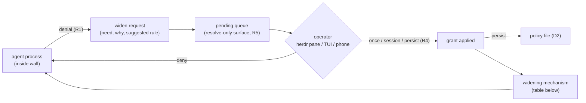

# Escalation alignment — analysis

> Companion: [composition-split-analysis.md](./composition-split-analysis.md)
> (round 2) — how pagu/pagu-box/flow/herdr overlap and conflict, and the
> control-plane / PA / data-plane split that composes them. Read this doc for
> the friction evidence and gap matrix; read the companion for the
> architecture that reconciles the tools.

**Map:** [The problem](#the-problem-evidence) · [pagu-box today](#pagu-box-today-structural-diagnosis)
· [Ecosystem philosophy](#what-the-ecosystem-needs-from-pagu-box) · [Prior art](#prior-art-verified)
· [Gap matrix](#gap-matrix) · [Design directions](#design-directions) · [Sequencing](#recommended-sequencing)

## The problem (evidence)

The operator's permission options form a bad dichotomy, and real sessions show
which side wins:

| Posture | What actually happens | Evidence `[prose — transcript observations]` |
| --- | --- | --- |
| auto-approval / ask-rules | denials + prompt fatigue → operator flips modes | lang-bang session `~/.claude/projects/-srv-share-projects-lang-bang/bd829120-*.jsonl`: baseline is `bypassPermissions` from message 1 (352 records); plan/auto/acceptEdits used only as *structure*, always returning to bypass; subagents spawned with `--dangerously-skip-permissions` |
| full permissions ("the gamble") | no safety layer at all | same session; codex sessions run `approval_policy: on-request` with **zero** recorded approval events |
| pagu-box `strict` | works for dispatched children, but too restrictive for lead/interactive work with no way to ask for more → operator bails back to the gamble | probe below; operator report (this session's task statement) |
| procedural "read-only" advisors in herdr panes | trust, not enforcement — a host process with inherited credentials | semantic-packages ADR 0015 (`docs/decisions/0015-operator-led-herdr-consultation.md` on branch `agent/cold-human-inspection`): "no pagu-box `strict` guarantee"; herdr-workflow + flow-dispatch transcripts show reviews constrained only by prompt text |

Key reading of the evidence: **friction does not surface as recorded denials —
it surfaces as mode capitulation.** By the time a session is running, the
operator has already chosen gamble-or-friction; there is no artifact showing
*what* would have been denied, so the policy never improves. Denial
invisibility is upstream of everything else.

### What `strict` actually breaks (probed 2026-07-19)

`pagu-box --profile=strict --no-auto-agent bash` in a scratch git repo:

| Capability | Result | Consequence for a worker agent |
| --- | --- | --- |
| `git config user.name` | missing (tmpfs `$HOME`) | commits fail or are misattributed |
| `gh auth` | absent (by design) | no push/PR — intended for children, fatal for a lead |
| cross-repo reads (`/srv/share/projects/*`) | blocked | multi-repo work (worktrees, sibling repos, homelab refs) impossible |
| nix eval via daemon | **works** (daemon socket bound) | builds fine |
| `$PWD` writes | works | core loop fine |

Each row is a legitimate, common need with no in-band remedy: the only options
are quit-and-relaunch with hand-crafted `--allow` flags, or quit-and-gamble.

## pagu-box today (structural diagnosis)

`src/linux.nix` / `src/darwin.nix` are **launch-time policy compilers**:
flags → profile → bwrap/seatbelt args → `exec`. Three structural facts follow:

1. **No runtime seam.** After `exec` there is no pagu-box process; nothing
   exists that *could* receive, evaluate, or forward a widen request. Policy is
   frozen for the process lifetime. `[structural — the script ends in exec]`
2. **Denials are invisible.** bwrap denials manifest as ENOENT/EACCES inside
   the sandbox; nothing records "policy X blocked path Y." The README's own
   future-work item 2 (audit mode) names this. `[prose]`
3. **Policy is not data.** Profiles are case-arms in a shell script; there is
   no machine-readable statement of the compiled policy that another system
   (flow, herdr, an approver UI) could consume, diff, or verify. `[prose]`

These are the right properties for the original role (a disposable hard wall
around untrusted children). They are the wrong properties for the role the
workflow now needs (below).

## What the ecosystem needs from pagu-box

All firsthand-read sources converge on one authorial philosophy. The table maps
each principle to its concrete implication for pagu-box:

| Source (read firsthand) | Principle | Implication for pagu-box |
| --- | --- | --- |
| flow `AGENTS.md` | "harness registry advertises capabilities but never grants authority; Flow grants, **the execution sandbox must enforce it independently**" | pagu-box is the named independent enforcer in flow's model — a first-class actor, not an accessory |
| flow ADR 0005 | grants are a **portable IR**; adapters *lower* them to OS controls and **report enforcement fidelity**; required enforcement **fails closed** when no faithful lowering exists | pagu-box needs a declarative policy input (not just flags) + a way to report what it did/didn't enforce |
| flow ADR 0015 | sandbox claims are untrusted until **falsified against**; refusals are retained, replayable **evidence** (it caught agent-dispatch's depth bypass) | pagu-box policy must be observable & probeable: machine-readable compiled policy, stable digests, denial records |
| flow `AGENTS.md` / constitution | "**every denial must be explainable** … and should expose still-enabled alternatives"; authority **narrows monotonically** across delegation | denials need structure (what, why, what's still possible); widening must route *up* to the operator, never be self-served |
| semantic-packages ADR 0015 | herdr-pane advisors run un-sandboxed under a manual operator protocol; explicit revisit-when: "**Herdr gains an enforced child sandbox** [or] the provider can be launched with a verified stripped control environment and filesystem policy" | a standing, documented feature request for the pagu-box↔herdr seam |
| pagu `CONTEXT.md` | **discovery-via-denial** (cage denials surface needed perms at review); auto-approve within a pre-vetted envelope; human gate reserved for novelty; **approval fatigue is a named risk**; standing grants (`/grants`/`/revoke`); pending-proposal queue with a **resolve-only** remote approver (`pagu serve`) | the family's escalation DNA already exists — port the shape, not the runtime |
| homelab `agent-dispatch.sh` (flow-dispatch worktree) | depth recorded immutably in the pagu-box PID-namespace `/proc/1/environ`; capability-monotone descent; "**herdr's owner-only socket can launch host commands, so exposing it would let a strict child escape**" | the escalation channel must NOT be the herdr socket; it must be a narrower, resolve-only surface |

Operator threat-model ranking (stated for this analysis): **secrets/credential
exfil ≥ host damage ≥ repo integrity > network egress** (egress wanted
mostly-open, fine-grained option for advisors). This matches pagu-box's
existing deny-list emphasis and means the escalation design should spend its
friction budget on secret/host/repo boundaries, not on domain prompts.

## Prior art (verified)

Two claims verified at the source; the rest from a ranked survey
(URLs in [Sources](#sources)).

| System | Mechanism | Verdict for pagu-box |
| --- | --- | --- |
| **Claude Code sandboxed Bash** (docs read firsthand) | sandbox-by-default (bwrap+socat proxy / Seatbelt); OS boundary *replaces* per-command prompts (auto-allow); **two runtime escalation channels**: first-use network-domain prompt (grant persists for session; `allowedDomains` persists as config) and sandbox-failure → retry with `dangerouslyDisableSandbox` routed through the permission flow; governable via `allowUnsandboxedCommands:false`, ask-rule on `Bash(dangerouslyDisableSandbox:true)`; credentials `deny`/`mask` with proxy-side injection (`injectHosts` + `tlsTerminate`) | the closest production reference. Note two gaps it leaves: file-path widening is **config-only** (no runtime prompt), and escalation is all-or-nothing (leave the sandbox, not widen it) |
| **Codex CLI on-request** (prompt template read firsthand) | typed escalation: `sandbox_permissions: "require_escalated"` + mandatory one-sentence `justification` + optional **`prefix_rule`** (a suggested reusable authorization rule); optional `auto_review` reviewer-agent triages escalations before the human | the only shipped *typed* "may I widen?" protocol; decision→persisted-rule is already in the schema shape |
| **srt / sandbox-runtime** (Anthropic, OSS) | the extracted bwrap/Seatbelt/proxy primitive; static settings file; no approval callback | confirms pagu-box's substrate choice; also confirms standalone-wall tools don't do escalation — the interactive layer lives above |
| **Sandlock** (arXiv 2605.26298) | split by decision type: static invariants → Landlock/seccomp-bpf (kernel, irrevocable); **runtime-value-dependent decisions → seccomp user-notify supervisor** with on-behalf ops | the cleanest architecture statement of static-wall vs live-supervisor; the seam where a human-facing approver bolts on |
| **ConLeash** (arXiv 2605.11360) | consent middleware: auto-permit inside known boundary, escalate the rest; **each human decision is refined into a reusable scoped rule** (98.2% permit/escalate accuracy; users preferred it over per-call prompts) | the academic form of decision→policy persistence — the loop that makes prompts *decrease over time* |
| **Android runtime permissions / macOS TCC** | static manifest of possible capabilities; runtime human grant of actual capability; once / session / always / auto-expire scopes | the grant-scoping UX vocabulary to steal |

**The consensus split** (every production system): escalation channel A =
"reach a new *destination*" (cheap, granular, session-persistable) vs channel B
= "leave the *sandbox* entirely" (expensive, per-decision, justification
required). **Nobody ships the middle rung — "widen the sandbox by one
path/capability and keep me inside it," at runtime.** Claude Code's path
widening is config-only; Codex's escalation is all-or-nothing per command.
That middle rung is exactly what the probed `strict` failures need
(one `--allow ~/.config/git`-shaped grant, not sandbox exit).

**Interaction hazard (verified in docs):** Claude Code's own sandbox is
bwrap-based. Running it *inside* pagu-box nests user namespaces; the inner
sandbox fails without `enableWeakerNestedSandbox` (which weakens it) or
namespace headroom. Composition of the two layers must be designed, not
assumed. `[prose — needs an empirical probe in the design phase]`

## Gap matrix

What the workflow needs vs what exists:

| Requirement | pagu-box today | Nearest prior art |
| --- | --- | --- |
| R1 · denials are recorded, structured, explainable | ✗ (invisible) | Claude Code failure analysis; flow ADR 0015 refusal evidence |
| R2 · policy is declarative data: per-project/per-role files, machine-readable compiled output, digestable | ✗ (flags + case-arms; README future item 4) | flow ADR 0005 grant IR; srt settings file |
| R3 · runtime widen-request: structured `{need, why, suggested-rule}` surfaced to the operator | ✗ (no runtime seam) | Codex `require_escalated`+`justification`+`prefix_rule` |
| R4 · decision scopes: once / session / persist-as-policy, revocable | ✗ | ConLeash refinement; Claude Code session domain grants; pagu `/grants` |
| R5 · approval surface reachable from herdr, **resolve-only** (cannot inject or widen from inside) | ✗ | pagu `serve` pending-proposal queue; agent-dispatch's herdr-socket exclusion rule |
| R6 · enforcement fidelity report + probeability (flow can derive a descriptor) | ✗ | flow ADR 0005/0015 |
| R7 · the middle rung: widen one path/capability **without** sandbox exit | ✗ | none shipped anywhere (novelty) |
| R8 · sandboxed pane launch in herdr (sp ADR 0015 revisit condition) | ✗ | — (seam work) |

## Design directions

Ordered by the SOUL rule: name the most-correct answer first, with its real
cost. These are directions for the design phase, not decisions.

### D1 — Denial observability (prerequisite; smallest)

You cannot ask about what you cannot see. An audit layer that records what the
sandbox blocked (and what the process attempted) turns "strict is too
restrictive" from a feeling into a diffable artifact, and is the input to every
other direction. Options, weakest→strongest: wrap-and-log ENOENT/EACCES
heuristics · fanotify/eBPF observation (README future item 2) · seccomp
user-notify (observes *and* can adjudicate — shared mechanism with D3).
Cost: a pagu-box runtime component appears for the first time (supervisor
process joins the TCB).

### D2 — Policy as data (the flow-alignment move)

Per-project/per-role policy files (`.pagu-box.toml` or nix-generated),
`--explain` emitting the exact compiled policy (machine-readable, digestable),
and a fidelity statement (what was requested vs what this platform enforced).
This makes pagu-box a *lowering target* for flow's grant IR (ADR 0005) and
probeable per flow ADR 0015 — and it is how herdr can launch policy-carrying
panes (D4) without inventing its own policy language.
Cost: a schema to keep stable; policy files become attack surface (must be
outside the sandbox's writable set, cf. Claude Code's self-protecting
settings).

### D3 — The escalation channel (the core novelty)

*Legend: solid = request/decision flow; the queue is writable from inside only
as append-request, resolvable from outside only — mirroring pagu `serve`.*

Widening mechanisms, in descending correctness order:

| Mechanism | How | Cost / risk | Status |
| --- | --- | --- | --- |
| **Relaunch with widened policy + harness resume** | grant updates policy file → sandbox restarts → `claude --resume` / `codex resume` inside | correct by construction (policy always = one launch-time compilation); cost = session interruption seconds, harness must resume cleanly | buildable today |
| **Live bind injection via fd passing** | supervisor opens the granted path outside, passes fd / `open_tree`+`move_mount` into the sandbox's mount namespace | keeps the process alive; mechanism is subtle (userns capability rules, TOCTOU) — **hypothesis, must be spiked and falsified first** | unverified |
| **Broker-mediated access** (per-resource, not per-mount) | secrets/network never widen at all: a proxy injects credentials at the boundary (Claude Code `mask`/`injectHosts`; Claw Patrol lineage) | strongest for the #1 threat (secret exfil — secret never enters the sandbox); per-protocol work | partial prior art |
| **Compose with harness-native escalation** | pagu-box = outer ceiling (secrets/host/repo); harness sandbox+permission flow = inner asker; harness "escape" still lands inside pagu-box | cheapest path to value; but nested-bwrap hazard (above) and two policy languages to keep coherent | needs the nesting probe |

### D4 — The herdr seam

herdr becomes (a) the **launcher**: `herdr pane run --sandbox <policy>` wraps
the pane command in pagu-box with a declared policy (satisfies sp ADR 0015's
revisit condition — an *enforced* child/advisor sandbox); and (b) the
**approval surface**: widen requests appear as pane/notification events the
operator resolves where they already live. Constraint (from
`agent-dispatch.sh`): the herdr control socket stays outside every sandbox;
the request channel is a separate, resolve-only socket/dir per D3.
Cost: herdr-side feature work (its repo is upstream Rust, not in this tree —
integration may have to live in wrapper scripts / herdr config first).

## Recommended sequencing

1. **D1 + D2 first** (observability + policy-as-data): no escalation UX is
   designable without denial evidence, and both are useful standalone (flow
   descriptor derivation, per-project profiles killing today's most common
   frictions — git identity, cross-repo RO binds).
2. **D3 via the relaunch mechanism** (correct, buildable) with the Codex-shaped
   request schema (`need` + `justification` + `suggested_rule`) and
   Android-shaped scopes (once / session / persist). Spike the live-bind and
   nesting hypotheses in parallel; adopt only what survives falsification.
3. **D4** once D2's policy files exist for herdr to point at.

Design-phase falsifiers to write before building (flow discipline): a denial
that produces no record (kills D1); a policy file whose compiled output differs
from `--explain` (kills D2); a widen-request resolvable from inside the sandbox
(kills D3); a sandboxed pane that can reach the herdr socket (kills D4).

## Sources

Firsthand: pagu-box `src/*`; pagu `README.md`+`CONTEXT.md`; flow `AGENTS.md`,
`docs/vision/constitution.md`, ADR 0005/0015; semantic-packages ADR 0015
(branch `agent/cold-human-inspection`); homelab-flow-dispatch
`modules/home/agent-dispatch.sh`; harness transcripts (paths in
[The problem](#the-problem-evidence)); strict-profile probe (this doc);
<https://code.claude.com/docs/en/sandboxing>; Codex escalation template
(`codex-rs/prompts/templates/permissions/approval_policy/on_request_rule_request_permission.md`).

Survey (agent-gathered, summaries not independently verified):
Anthropic sandboxing blog (claims 84% prompt reduction) ·
srt <https://github.com/anthropic-experimental/sandbox-runtime> ·
Sandlock <https://arxiv.org/abs/2605.26298> ·
ConLeash <https://arxiv.org/abs/2605.11360> ·
Codex approvals <https://developers.openai.com/codex/agent-approvals-security> ·
`seccomp_unotify(2)` · Agent SDK `canUseTool`
<https://code.claude.com/docs/en/agent-sdk/permissions>.
